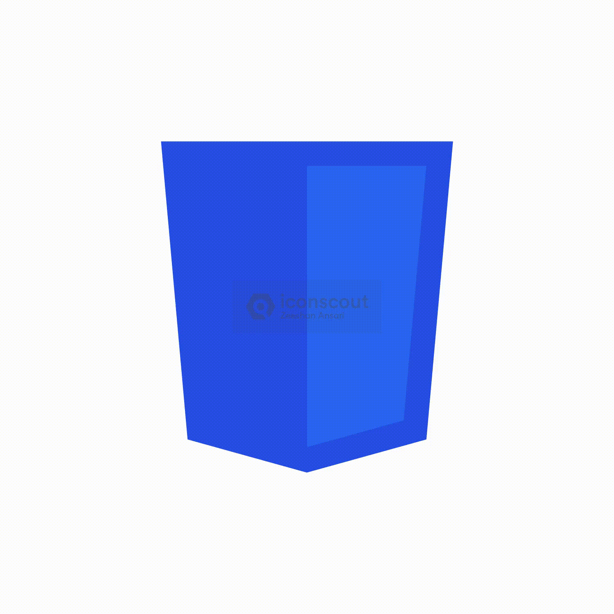
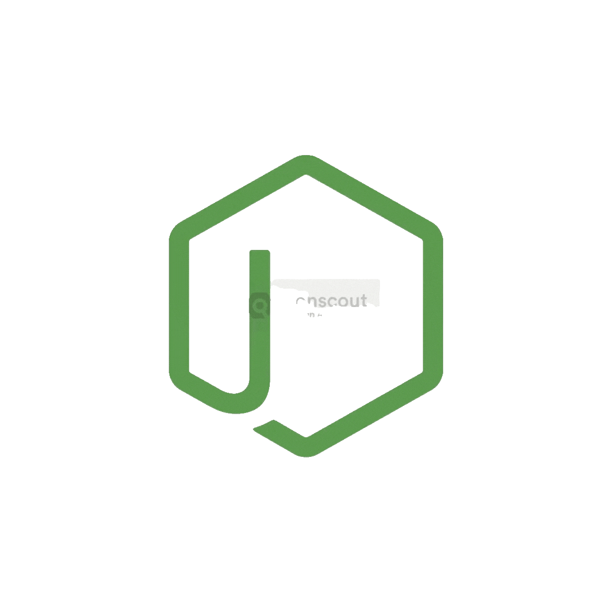
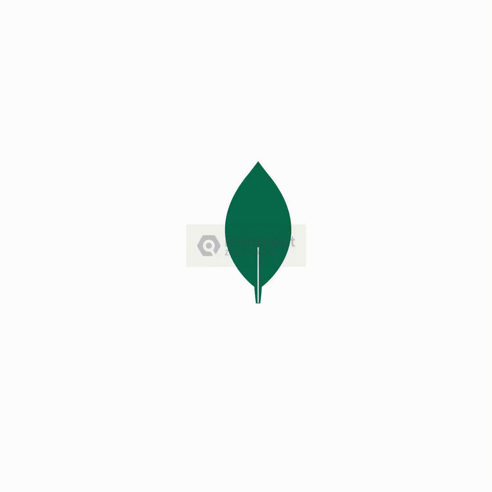

  
# 👋 Hi, I'm Pushpraj Pandey

## 🤝 Connect With Me

---
  
## 🔥 About Me

- 🎓 **Software Engineer** with expertise in **Full Stack Development** and **DevOps**
- 🌱 Currently exploring **Cloud Technologies**, **AI/ML**, and **Data Science**
- 💡 Love building **scalable applications** and **automating workflows**
- 🎯 Focused on **clean code**, **best practices**, and **continuous learning**
- 📧 Reach me at: **sajalpandey858@gmail.com**
- 🌐 Portfolio: **[pushprajpandey.vercel.app](https://pushprajpandey.vercel.app)**

 

---

## 📊 Profile Stats

  
  

---

## 💡 Professional Experience

### 🏢 SmartBridge - Full Stack Developer
**Jan 2025 - Apr 2025** | *Internship*

- 💰 Built comprehensive **expense tracker** application using **React.js, Node.js & MongoDB**
- 🤖 Implemented **AI-powered categorization** for automatic expense classification
- ⚡ Achieved **60% reduction** in manual data entry through intelligent automation
- 🚀 Optimized database queries resulting in **40% faster** performance
- 🔐 Integrated secure authentication and real-time data synchronization

---

## 🛠️ Tech Stack

### 💻 Languages

<table>
<tr>

<td align="center" width="96">
  
   <b>Python</b>
</td>

<td align="center" width="96">
  
   <b>Java</b>
</td>

<td align="center" width="96">
  
   <b>JavaScript</b>
</td>

<td align="center" width="96">
  
   <b>TypeScript</b>
</td>

<td align="center" width="96">
  
   <b>C++</b>
</td>

</tr>
</table>
🌐 Frontend

<table>
<tr>
<td align="center" width="96">

 <b>React</b>
</td>
<td align="center" width="96">
  
   <b>Redux</b>
</td>
<td align="center" width="96">
  
   <b>HTML5</b>
</td>
<td align="center" width="96">
  
   <b>CSS3</b>
</td>
<td align="center" width="96">
  
   <b>Tailwind CSS</b>
</td>
</tr>
</table>

⚙️ Backend & Systems

<table>
<tr>
<td align="center" width="96">
    
     <b>Node.js</b>
</td>
<td align="center" width="96">

 <b>Express.js</b>
</td>
<td align="center" width="96">

 <b>FastAPI</b>
</td>
<td align="center" width="96">
  
   <b>REST API</b>
</td>
<td align="center" width="96">
  
   <b>Caching</b>
</td>
</tr>
</table>

🗄️ Databases & Data

<table>
<tr>
<td align="center" width="96">
  
   <b>MongoDB</b>
</td>
<td align="center" width="96">

 <b>PostgreSQL</b>
</td>
<td align="center" width="96">
  
   <b>MySQL</b>
</td>
<td align="center" width="96">

 <b>Redis</b>
</td>
</tr>
</table>

☁️ Cloud & DevOps

<table>
<tr>
<td align="center" width="96">

 <b>AWS</b>
</td>
<td align="center" width="96">

 <b>Docker</b>
</td>
<td align="center" width="96">

 <b>Jenkins</b>
</td>
<td align="center" width="96">

 <b>CI/CD</b>
</td>
</tr>
</table>

🤖 AI & Computer Vision

<table>

<td align="center" width="96">

 <b>OpenCV</b>
</td>
<td align="center" width="96">

 <b>Pandas</b>
</td>
</tr>
</table>

🧠 Core CS & Engineering

<table>
<tr>
<td align="center" width="96">
  
   <b>Linux</b>
</td>
<td align="center" width="96">
  
   <b>Git</b>
</td>
<td align="center" width="96">
  
   <b>GitHub</b>
</td>
</td>
</tr>
</table>

Data Structures & Algorithms • OOP • Operating Systems • DBMS • System Design
Microservices Architecture • API Optimization • Database Indexing • Query Optimization
Caching Strategies • RESTful API Design

---

## 📈 GitHub Statistics

  

 

  

---

## 💭 Random Dev Quote

  

  

### ⭐ From [Pushpraj Pandey](https://github.com/PushprajPandey)

